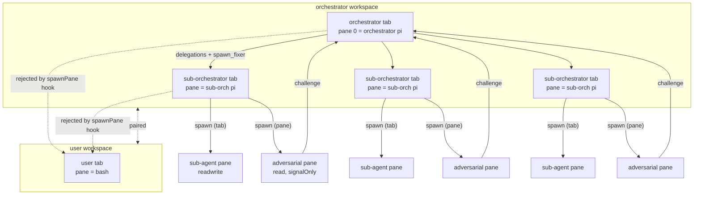

# Spec-2 — Orchestrator v2 + User Workspace

> **Source of truth:** fixture spec under `fixtures/sandbox-spec/src/`, runtime
> impl under `impl/`, and the ADRs under `docs/adr/`. The plan that drives
> this rewrite is at `spec-2_orchestrator_v2_+_user_workspace_7cb68ec4.plan.md`
> in the parent plans store.
>
> Spec-2 takes the orchestrator v1 (read-only orchestrator + sub-orchestrators
> + adversarial swarm + surgical fixers, all flat) and adds two structural
> constraints:
>
> 1. **One orchestrator per orchestrator workspace** — the orchestrator lives
>    in pane 0 of the first tab; sub-orchestrators live in **additional tabs**
>    of the same workspace, never in panes of the orchestrator's tab.
> 2. **A reserved user workspace and user tab** — every orchestrator workspace
>    ships with a dedicated `user` workspace/tab; no sub-orchestrator may
>    ever be spawned into it. No herdr fork; the reservation is enforced by
>    the orchestrator's runtime hooks and the tab-name convention.

This document is the **glossary and architecture reference** for spec-2. It
defines every term, the scope changes from the prior spec, the architecture
diagram, and what is explicitly out of scope.

---

## 1. Glossary

> Each term is defined as it is used in spec-2. References point at the file
> that contains the canonical definition or runtime hook.

### 1.1 `workspace`
A herdr workspace. The top-level container in herdr that holds tabs, panes,
and a single default cwd. Concretely a workspace is what `herdr tab create
--workspace <id>` writes into and what `herdr pane list` groups panes under.
Every workspace has exactly one orchestrator (or one user) as its first
occupant, and zero or more additional tabs. See
`fixtures/sandbox-spec/src/governance.ts` and `impl/pty/herdr-session.ts`
(`spawnPaneInNewTab`, `parseWorkspaceId`).

### 1.2 `orchestrator workspace`
A herdr workspace whose first tab is an orchestrator. Every orchestrator
workspace ships with three things: the orchestrator's tab, a `user` tab, and
zero or more sub-orchestrator tabs. There is **exactly one orchestrator per
orchestrator workspace** — see ADR 0001. The runtime creates the orchestrator
workspace via `openOrchestratorSession()` in
`impl/orchestration/orchestrator-session.ts`, which then calls
`spawnOrchestrationTeam()` in `impl/orchestration/team-spawner.ts` to add
sub-orchestrator tabs.

### 1.3 `orchestrator`
A `pi` process running in pane 0 of the orchestrator tab. The orchestrator is
**read-only but fully autonomous**: it may plan, delegate, and dispatch
fixers, but its pane is gated by the `READ_ONLY_COMMAND_RE` allowlist in
`impl/pty/herdr-session.ts`. The orchestrator decides *what* to do; the
runtime only stops it from *writing*. `capability = "read"`, `depth = 0`.
The orchestrator's system prompt is built in `ORCHESTRATOR_SYSTEM_PROMPT` in
`impl/orchestration/orchestrator-session.ts`.

### 1.4 `user workspace`
A herdr workspace reserved for the user. Spec-2 opens **one user workspace per
orchestrator workspace** — they are paired. The user workspace is the only
place a human can directly drive the system: it runs bash, has readwrite
capability, and no sub-orchestrator is ever spawned into it. The tab ID
constant is `USER_WORKSPACE_TAB_ID = "user"` in
`fixtures/sandbox-spec/src/user-workspace.ts`. See ADR 0002 for the
limitations of runtime-only enforcement (OS-UID isolation belongs to spec-3).

### 1.5 `user tab`
A tab named `user` in the **user workspace** (1.4). The user tab is the bash
REPL the human drives. It is the only pane/tab in the user workspace. The
runtime hook in `impl/pty/herdr-session.ts:spawnPane` (Phase 1.3) refuses to
spawn any pane into a tab whose label starts with `user-`, which is the
mechanical guarantee that no sub-orchestrator can land in the user tab. The
orchestrator's system prompt carries the same rule in plain English
("Never spawn sub-orchestrators into a tab whose label starts with `user-`").

### 1.6 `sub-orchestrator tab`
Any tab in the **orchestrator workspace** (1.2) other than the orchestrator's
first tab and other than the user tab. One sub-orchestrator tab per
workstream (e.g. `scaffold_2`, `deps`, `git-worktree`). Created by
`spawnPaneInNewTab` in `impl/pty/herdr-session.ts` with a label like
`orch-scaffold_2` and a fresh pane running `pi --version`. The team spawner
in `impl/orchestration/team-spawner.ts:spawnSubOrchestrator` issues these
calls in Phase B.

### 1.7 `sub-orchestrator`
A read-only `pi` process that runs inside a sub-orchestrator tab. Like the
orchestrator it has `capability = "read"`, but it is *not* in pane 0 of its
workspace — it shares the orchestrator's workspace, just in its own tab. A
sub-orchestrator delegates work to sub-agents; the sub-orchestrator is itself
spawned and managed by the orchestrator. Represented in the spec by
`SubOrchestratorHandle` in `fixtures/sandbox-spec/src/orchestration.ts`. Depth
1 by default; max depth is `SUB_ORCHESTRATOR_MAX_DEPTH = 3`.

### 1.8 `sub-agent`
A worker process spawned by a sub-orchestrator (or, in shallow workstreams,
directly by the orchestrator). Sub-agents live as **panes inside a
sub-orchestrator tab** — the `tabPlacement: "pane"` default in
`fixtures/sandbox-spec/src/multiplexing.ts:SubAgentConfig`. A sub-agent may
be `read` or `readwrite` (`Capability` from
`fixtures/sandbox-spec/src/governance.ts`). Read-write sub-agents are
**unconstrained by the runtime allowlist** — they can run any command in
their pane. OS-level isolation of read-write sub-agents belongs to spec-3,
out of scope here.

### 1.9 `adversarial sub-agent`
A signal-only sub-agent: `capability: "read"`, `signalOnly: true`. Its only
allowable signal is `challenge`. It reads the work in progress and emits
`Challenge` verdicts with `severity: "block" | "warn"`. Defined in
`impl/orchestration/adversarial-protocol.ts` and produced in Phase C of
`spawnOrchestrationTeam()` in `impl/orchestration/team-spawner.ts`. The
adversarial swarm is one adversarial per sub-orchestrator + one global
adversarial (`GLOBAL_ADVERSARIAL_NAME = "adv-global"`) that targets pane 0
itself.

### 1.10 `surgical fixer`
A readwrite sub-agent that the orchestrator dispatches on demand when the
adversarial swarm blocks a workstream. The fixer's job is to apply the
**minimum, precise patch** that resolves a `block` challenge. The orchestrator
looks the fixer up in `/etc/surgical-fixers` (the registry written by
`writeSurgicalFixersRegistry` in `team-spawner.ts`); the runtime entry point
is `spawnFixer()` in the same file. The fixer's prompt lives in
`impl/scripts/prompts/surgical-fixer.md`.

---

## 2. Scope changes from the previous spec

The previous spec (spec-1, captured in `sandbox/impl/docs/ADR-0007-readonly-orchestrator.md`
and the v1 DESIGN.md) defined an orchestrator-per-workspace concept but left
ambiguity on three structural questions. Spec-2 pins them down with these
five clarifications, each backed by local repo evidence.

### 2.1 One orchestrator in the first tab of each orchestrator workspace

> **What changed:** Previously the orchestrator was the only pane in the
> workspace's first tab, and sub-orchestrators could be added as additional
> panes *in that same tab*. Spec-2 forbids this.

**Rationale.** Sub-orchestrators as panes share the orchestrator's tab and
therefore its terminal buffer; long-running sub-orchestrator output buries
the orchestrator's plan. OpenHands' runtime model uses a single workspace per
session (`WORKSPACE_BASE` in `repos/OpenHands/containers/app/Dockerfile`),
which is the wrong granularity for our case — we need multiple cooperating
workspaces, not one. Opencode's permission system (`repos/opencode/packages/core/src/permission.ts`)
treats sessions as the isolation boundary and exposes per-session
`Ruleset`s; this aligns with the spec-2 model of one orchestrator per
workspace, with each workspace holding its own per-tab policy. The opensrc
skill at `repos/opensrc/skills/opensrc/SKILL.md` is the canonical way to
cross-reference such external implementations; we used it to read both
repos. See ADR 0001.

### 2.2 Sub-orchestrators = tabs only, never panes

> **What changed:** `SubAgentConfig.tabPlacement` is now an explicit
> `"tab" | "pane"` enum, defaulting to `"pane"`. Sub-orchestrators must
> pass `"tab"`.

**Rationale.** Tabs give herdr-level isolation: each sub-orchestrator's
buffer, focus, and pane-id namespace are independent. OpenHands does the
same conceptually via its per-conversation event log
(`repos/OpenHands/openhands/app_server/sandbox/`) — events from one
conversation never leak into another. Opencode's permission ruleset is
per-session, again reinforcing the session/tab as the isolation unit. Pinning
sub-orchestrators to tabs means the same isolation property the user already
sees on the TUI carries through to the orchestrator's internal structure.

### 2.3 Read-write sub-agents are unconstrained by the runtime allowlist

> **What changed:** `Capability = "readwrite"` no longer triggers
> `READ_ONLY_COMMAND_RE` in `herdr-session.ts:runInPane`. The allowlist only
> applies to `read`.

**Rationale.** A read-write sub-agent that the orchestrator dispatched to
apply a surgical patch is exactly the agent that needs to run `npm install`,
`git commit`, or `rm`. Gating it would break the surgical-fixer contract.
OS-level isolation (Docker `--user` per pane, separate containers per
capability tier) is the proper way to constrain what a misbehaving
read-write sub-agent can do, and that work is **spec-3**, not spec-2. The
opensrc skill at `repos/opensrc/skills/opensrc/SKILL.md` is what spec-3 will
use to read how OpenHands and opencode implement OS-level isolation when
that work begins.

### 2.4 The orchestrator is read-only but fully autonomous

> **What changed:** No `MUST`, no `MUST NOT`, no policy script. The
> orchestrator decides what to do; the runtime only stops it from writing.

**Rationale.** Earlier drafts included policy scripts that told the
orchestrator what kinds of plans to emit ("always include a verification
step", "never use sub-orchestrators for read-only tasks"). Those scripts
were not enforceable and made the orchestrator a puppet. Opencode's
permission system (`repos/opencode/packages/core/src/permission.ts`) draws
the same line: rules are declarative data; the *agent* decides when to act;
the *runtime* decides whether the action is allowed. The orchestrator's
system prompt lists the available sub-orchestrator templates, the
adversarial protocol, and the spawn_fixer lookup — but does not prescribe
*when* to use them. This matches opencode's `Effect = "allow" | "deny" |
"ask"` model in `repos/opencode/packages/core/src/permission/schema.ts:5-13`.

> **Stage C fix (Challenge 9) — opencode is a 3-state model with a
> ruleset, not a 2-state capability.** The `Effect` type at
> `repos/opencode/packages/core/src/permission/schema.ts:5-13` is
> `Effect = "allow" | "deny" | "ask"` and is evaluated by the
> `evaluate` function at `repos/opencode/packages/core/src/permission.ts:102-112`
> against a `Ruleset` (multiple rules with wildcards). When no rule
> matches, opencode falls back to `"ask"` (line 109), prompting the
> user. The spec-2 model is a deliberate **2-state simplification**:
> `Capability = "read" | "readwrite"`. We dropped the `"ask"` state
> because the spec-2 orchestrator is fully autonomous (it cannot ask
> a human in the middle of a dispatch) and dropped the ruleset
> because the spec-2 model is per-pane, not per-tool. The
> simplification is documented as such; the `Effect` type is
> cited so future readers can see what we simplified away.

### 2.5 Dedicated user workspace + user tab; runtime reservation only

> **What changed:** A user workspace is opened alongside every orchestrator
> workspace. The user tab label is fixed to `user` and the runtime
> `spawnPane` hook refuses to add a pane to any tab whose label starts with
> `user-`. No herdr fork is used.

**Rationale.** The user needs a place to drive the system directly. The
OpenHands sandbox model (`repos/OpenHands/openhands/app_server/sandbox/`)
exposes a per-session workspace, but does not formally separate the user's
interaction from the agent's work — that separation is enforced at the
runtime hook layer in their case too. Opencode's permission schema
(`repos/opencode/packages/core/src/permission/schema.ts`) is the closest
analog to a "user" capability, but it is session-scoped, not tab-scoped, so
we model the user tab as a sibling of the orchestrator tab rather than as
a special agent identity. **Limitation:** if a sub-agent shells out to
`docker exec herdr ...` directly, it bypasses the runtime hook; spec-3's
OS-UID separation is the proper mitigation. See ADR 0002.

---

## 3. Architecture summary

Spec-2's architecture is a four-level nesting: **workspace → tab → pane →
process**. The orchestrator owns its workspace and one tab within it; the
user owns a paired workspace and one tab; sub-orchestrators share the
orchestrator's workspace but get their own tabs; sub-agents share their
sub-orchestrator's tab but get their own panes.



**Key invariants (enforced in code):**

- The orchestrator tab is **the first tab** of the orchestrator workspace;
  pane 0 of that tab is the orchestrator. `openOrchestratorSession` in
  `impl/orchestration/orchestrator-session.ts` opens the workspace and pins
  pane 0.
- Sub-orchestrator tabs are **siblings** of the orchestrator tab, created by
  `spawnPaneInNewTab` in `impl/pty/herdr-session.ts`. They are not panes of
  the orchestrator tab.
- The user workspace is **paired one-to-one** with each orchestrator
  workspace. It is opened by `spawnOrchestrationTeam` (Phase 1.3) and its
  handle is returned on `OrchestratorSession.userWorkspace`.
- The `spawnPane` runtime hook in `impl/pty/herdr-session.ts` rejects
  `herdr agent start --tab user-*` with an `Error`. This is the only
  mechanical guarantee against a misbehaving sub-orchestrator landing in
  the user tab.

---

## 4. What is out of scope

The following are **explicitly excluded** from spec-2 and tracked elsewhere:

- **OS-UID separation (spec-3).** The runtime allowlist in
  `herdr-session.ts` stops the orchestrator and read-only sub-orchestrators
  from issuing write commands, but a sub-agent that already has
  `readwrite` capability can run anything inside the container. The proper
  mitigation is OS-level: separate UIDs, separate containers, or
  seccomp/AppArmor profiles per capability tier. This is spec-3, tracked
  under `docs/adr/` of the spec-3 worktree.

- **Forks of herdr or pi.** Spec-2 does not introduce a herdr fork. The
  user-workspace reservation is enforced at the orchestrator's runtime
  hook layer (`spawnPane` rejects `user-*` tab labels) and by convention in
  the orchestrator's system prompt. A herdr fork would be the right place
  to enforce the reservation at the daemon level, but that is a much
  larger change and is not in scope here.

- **Cross-orchestrator policy negotiation.** Spec-2's flat governance
  (ADR 0004 + 0005, restated in `sandbox/impl/docs/ADR-0007-readonly-orchestrator.md`)
  treats every agent as a peer of its parent and siblings. There is no
  mechanism for one orchestrator's sub-agent to talk to another
  orchestrator's sub-agent directly. Such cross-workspace coordination is
  out of scope; it would need its own governance ruleset, not a special
  case in the runtime.

- **Adversarial swarm and surgical fixer protocols.** These are inherited
  from spec-1 verbatim. Spec-2 reuses `adversarial-protocol.ts` and
  `team-spawner.ts` as-is. Changes to the protocol itself are out of scope.

---

## 5. Orchestrator & user-workspace lifecycle

Section 1 defined the static shape: who is the orchestrator, what is a
sub-orchestrator, where the user lives. This section defines the dynamic
shape: how those entities move through time. The prose below pins the
four lifecycle decisions that the previous draft left open. The pinned
answers are the ones the runtime already implements
(`impl/orchestration/{orchestrator-session,team-spawner}.ts` and
`impl/pty/herdr-session.ts:spawnPane`); ADR 0003 records them.

### 5.1 Orchestrator lifecycle

The orchestrator is a `pi` process in pane 0 of the orchestrator tab,
opened by `openOrchestratorSession()` and torn down by
`closeOrchestratorSession()`. Its state machine has five states:

| State        | Trigger to enter                                  | Trigger to leave                                | What it can do |
|--------------|---------------------------------------------------|-------------------------------------------------|----------------|
| `booting`    | `HerdrSession.open` succeeds                      | `pi` answers `pi --version` and accepts the system prompt | Run the boot sequence (export `AGENT_CAPABILITY=read`, send system prompt, look up pi PID). |
| `idle`       | Boot finished, no in-flight work                  | User types a prompt that the orchestrator begins to handle; or an adversarial produces a `block` challenge | Read any pane via `herdr pane read`; reply to the user via the user tab's pane; plan a new dispatch. |
| `busy`       | Orchestrator is handling a user prompt or coordinating a dispatch | All spawned sub-orchestrators have settled (returned to their `idle` state) and no `block` challenges are open | Spawn sub-orchestrators (one per workstream); dispatch surgical fixers via `spawnFixer()`; read challenge log; re-plan. |
| `idle-again` | All in-flight work settled, no open challenges    | New user prompt or new `block` challenge arrives | Same as `idle`. |
| `terminated` | `closeOrchestratorSession()` is called, or herdr daemon dies | (terminal) | Nothing. The session object is dead. |

The orchestrator is **always in one of these five states** while the
session is open. Transitions are driven by the runtime polling the
herdr daemon (`herdr pane list`, `herdr pane read`, `herdr pane get`)
and by the orchestrator's own decisions in response to that polling. The
runtime does not push events to the orchestrator; the orchestrator
polls.

**Why polling, not push:** opencode's `Effect = "allow" | "deny" | "ask"`
model (`repos/opencode/packages/core/src/permission/schema.ts`) treats
the agent as the poll-driven decision maker. We mirror that for
consistency: the orchestrator decides when to act, the runtime enforces
whether the action is allowed. The same principle applies to challenge
handling — the orchestrator reads `/tmp/adversarial.log` (per the system
prompt) on its own schedule.

### 5.2 Sub-orchestrator lifecycle

A sub-orchestrator is a `pi` process in pane 0 of a sub-orchestrator
tab. It is created by `spawnSubOrchestrator()` (phase B of
`spawnOrchestrationTeam`) and runs `pi --version` as a smoke test; the
runtime then promotes it to a real sub-orchestrator by sending it the
sub-orchestrator system prompt (out of scope for spec-2 — the prompt
template is set in spec-3, but the slot is wired here).

| State                    | Trigger to enter                                                                                  | Trigger to leave                                                | What it can do |
|--------------------------|---------------------------------------------------------------------------------------------------|-----------------------------------------------------------------|----------------|
| `spawned`                | `spawnPaneInNewTab` returns a `paneId` + `tabId` for the workstream                                | The orchestrator sends the sub-orchestrator its system prompt  | Nothing user-visible — smoke test only. |
| `busy`                   | Orchestrator sends the sub-orchestrator a delegated task                                            | Sub-orchestrator returns to its prompt with no open challenges | Spawn sub-agents in its own tab (`tabPlacement: "pane"`); run read-only commands; emit output to its buffer. |
| `idle`                   | Sub-orchestrator's pane is alive, no in-flight work, no `block` challenges against it              | Orchestrator dispatches a new task, or an adversarial produces a `block` challenge | Same as `busy`, just waiting. |
| `spawned-fixer`          | Orchestrator called `spawnFixer(workstream)` in response to a `block` challenge; fixer pane created | Fixer applies the patch and reports back                       | Read + write (`capability: "readwrite"`); the patch is logged to the challenge log. |
| `idle` (post-fixer)      | Fixer reported back; orchestrator's verifier (`adv-global` or the per-workstream adversarial) accepts the patch | New task or new challenge                                       | Same as `idle`. |
| `terminated`             | The orchestrator is closed, or herdr daemon is stopped                                              | (terminal)                                                      | Nothing. The pane is killed by `herdr server stop`. |

The sub-orchestrator is a **leaf-coordinator**: it has no children that
can spawn grandchildren. Sub-agents under a sub-orchestrator are
panes (not tabs), and the sub-orchestrator's `tabPlacement` is always
`"pane"` for those children. A sub-orchestrator cannot itself spawn
a sub-sub-orchestrator — that would require depth ≥ 2 in the same tab,
and the spec-2 invariant is exactly one sub-orchestrator per tab.

### 5.3 User-tab behavior

The user tab is the bash REPL in pane 0 of the `user`-labeled tab. It
is created in phase A of `spawnOrchestrationTeam()`, before any
sub-orchestrator is spawned. The behaviors pinned here are:

- **Always present.** Every orchestrator workspace has exactly one user
  tab. The spec's `[[workspace]]` array MUST declare exactly one block
  with `role = "user"`, and that block's first tab MUST have
  `label = "user"`. The validator in
  `src/launch-sandbox.ts:parseLaunchSandboxSpec` enforces both.
- **Bash interactive.** The user tab's root pane is `bash`. The user
  types commands; bash executes them; output goes to the user tab's
  buffer.
- **Isolated from sub-orchestrators.** No sub-orchestrator pane is
  ever in the user tab. The runtime hook in
  `impl/pty/herdr-session.ts:spawnPane` rejects any `targetTabId`
  whose tab label starts with `user-`. The orchestrator prompt carries
  the same rule in plain English.
- **Isolated from the orchestrator's output.** The orchestrator
  *reads* the user tab via `herdr pane read <user-pane>` to see what
  the user typed. The orchestrator does **not** `send-text` into the
  user tab. The user owns that tab; the orchestrator is a guest
  observer.
- **Filtered out of sub-orchestrator pane lists.** When the
  orchestrator hands a sub-orchestrator the list of panes it should
  coordinate with, the user tab's pane id is **filtered out** (per
  spec-2 plan §1.4: "Plus: sub-orchestrator never sees the user tab's
  pane id"). A sub-orchestrator that asks `herdr pane list` itself
  *will* see the user pane, but the orchestrator does not pass it in
  the dispatch envelope.

### 5.4 The runtime hook in `spawnPane`

`impl/pty/herdr-session.ts:HerdrSession.spawnPane` has a label-based
guard at the top of the method:

```ts
if (typeof opts.targetTabId === "string" && opts.targetTabId.length > 0) {
  const tabLabel = readTabLabel(this.containerId, opts.targetTabId);
  if (tabLabel !== null && (tabLabel === "user" || tabLabel.startsWith("user-"))) {
    throw new Error(
      `spawnPane: refused — target tab is reserved (user-*) (tabId="${opts.targetTabId}", label="${tabLabel}")`,
    );
  }
}
```

The guard reads the **label** of the target tab, not the id. Labels are
human-readable and pinned to `"user"` by `launch-sandbox.toml`. The
guard fires when:

- `targetTabId` is set (otherwise the spawn goes to a default tab and
  the guard is irrelevant), AND
- the resolved label is `"user"` or starts with `"user-"`.

The guard does **not** fire for `tabLabel = "orch-scaffold_2"` or any
other non-user label. It is the only mechanical guarantee that a
sub-agent calling `spawnPane` cannot land in the user tab from inside
the runtime hook layer — but only when `targetTabId` is set.

> **Stage C fix (Challenge 3) — opt-in semantics:** the guard is
> **opt-in via `targetTabId`**. If a caller invokes
> `spawnPane(cmd)` with no `targetTabId`, the guard is silently
> bypassed: the call goes through herdr's default tab, and herdr's
> default may be the user tab on some versions. The orchestrator
> itself never uses that overload — every spawn it issues either
> passes `targetTabId` (when targeting a specific tab) or goes
> through `spawnPaneInNewTab` (which creates a fresh tab and does
> not reuse the user tab). The "mechanical guarantee against
> landing in the user tab" therefore only holds for callers that
> pass `targetTabId` explicitly. Callers that omit `targetTabId`
> are responsible for routing via `spawnPaneInNewTab` or for
> ensuring the daemon's default tab is not `user-*`. F7 in
> `orchestration.spec.ts` is the test that documents the
> opt-in shape: the guard fires with `targetTabId` and does
> **not** fire without it.

**Limitation:** a misbehaving sub-agent that calls
`docker exec herdr ...` directly (bypassing the runtime's `spawnPane`)
skips this guard. Spec-3's OS-UID separation is the proper mitigation;
ADR 0002 documents this.

### 5.5 TOML spec format for declaring a user workspace

The spec-2 `launch-sandbox.toml` (at `src/launch-sandbox.toml`) declares
the user workspace as a `[[workspace]]` block with `role = "user"`.
The validator in `src/launch-sandbox.ts` requires:

```toml
[[workspace]]
label = "user"
role = "user"
tab = [{ label = "user", cmd = ["bash"] }]
```

The validator enforces three constraints:

1. `role` is one of `"orchestrator"` (default if absent) or `"user"`.
   Any other value throws `LaunchSandboxSpecError`.
2. Exactly one `[[workspace]]` block has `role = "user"`. Zero is
   rejected ("no user workspace declared"); more than one is rejected
   ("more than one user workspace declared").
3. The user block's first tab's `label` is exactly `"user"`. The
   runtime hook keys off this string.

If the TOML is valid, `reserveUserWorkspaceFromSpec()` returns a
`UserWorkspaceHandle` with synthesized (but deterministic) workspace /
tab / pane ids. The runtime overwrites those ids with real ones from
the herdr daemon in phase A of `spawnOrchestrationTeam`.

---

## 6. Concrete scenarios

This section stress-tests the prose above with four concrete
scenarios. Each scenario is a walkthrough of what the runtime actually
does given a realistic user prompt or system event. The scenarios are
the canonical way to spot a missing invariant; if a scenario can
silently fail, the spec is missing a guarantee.

### 6.1 "scaffold a TypeScript repo with three worktrees"

> User types into the user tab: `scaffold a TypeScript repo with three worktrees`.

Step by step:

1. **User types in the user tab.** The bash REPL in the user tab
   receives the line. No orchestrator is involved at this point —
   the user is just talking to bash.
2. **Orchestrator observes the user tab via `herdr pane read`.** The
   chosen input channel (ADR 0003 Q4; see also
   `docs/spec/sections/05-orchestrator-user-workspace.md:5.6` and the
   Stage C fix for Challenge 2) is the bash REPL: the orchestrator's
   polling loop reads the user tab's pane via
   `herdr pane read <user-pane>` to learn what the user typed. The
   user does not need any TUI keybind or external CLI to drive the
   orchestrator.
3. **Orchestrator is in state `idle`.** It reads the user's prompt
   via `herdr pane read <user-pane>` and transitions to `busy`.
4. **Orchestrator plans three workstreams.** It emits a plan:
   `scaffold_2`, `git-worktree`, `deps`. These are the canonical
   workstreams the runtime pre-registers in `/etc/surgical-fixers`.
5. **Orchestrator spawns three sub-orchestrators in parallel.**
   `spawnOrchestrationTeam()` runs the `for` loop in
   `impl/orchestration/team-spawner.ts`; the spawn calls themselves
   are sequential (await each), but the resulting sub-orchestrator
   panes are independent and run in parallel. The orchestrator
   does NOT block on the sub-orchestrators — it returns to `idle`
   as soon as the spawn phase returns, and from there polls the
   per-sub-orchestrator panes via `herdr pane read`.
6. **Sub-orchestrators work in parallel.** Each sub-orchestrator
   pane runs `pi` in its own tab. They share no state; they each
   see only the panes in their own tab.
7. **Adversarial swarm challenges the work.** The per-workstream
   adversarials (`adv-scaffold_2`, `adv-git-worktree`, `adv-deps`)
   read the sub-orchestrators' output and emit `Challenge`
   verdicts. `adv-global` reads pane 0 (the orchestrator's plan) and
   challenges plan-level decisions with `severity: "warn"`.
8. **A `block` challenge arrives.** `adv-scaffold_2` flags a missing
   TypeScript config file. The orchestrator reads the challenge
   (via polling `/tmp/adversarial.log` or via `herdr pane read` of
   the adversarial pane) and decides to dispatch a surgical fixer.
9. **Orchestrator calls `spawnFixer("scaffold_2")`.** The runtime
   looks up the registry, finds `fixer-scaffold_2 readwrite`,
   spawns a readwrite pane. The orchestrator hands the challenge
   text to the fixer pane via `send-text`.
10. **Fixer applies the patch.** The fixer creates the missing
    `tsconfig.json`. The orchestrator verifies via a follow-up
    `herdr pane read` of the sub-orchestrator pane.
11. **All workstreams settle.** The orchestrator transitions to
    `idle-again`. It posts a summary in its own pane (not the user
    tab — see §5.3).
12. **User reads the result.** The user types `cat /tmp/summary.txt`
    in the user tab. Bash executes; output goes to the user tab's
    buffer. The orchestrator is unaffected.

**Invariant verified:** the orchestrator is the dispatcher, the
sub-orchestrators are the workers, the adversarials are the
verifiers, the fixers are the patches, and the user is the observer.
No step requires the orchestrator to block on a sub-orchestrator.

### 6.2 User types `git status` in the user tab

> User types: `git status` in the user tab.

**Outcome:** The user tab's bash pane executes `git status` and prints
the result in the user tab's buffer. The orchestrator is **not
notified, not blocked, and not affected**. The orchestrator's pane
state machine stays in whatever state it was in (likely `idle`).

**Why:** The user tab is a separate bash process. The orchestrator's
`pi` process is in pane 0 of a different tab. They share a workspace
(per the spec-2 layout), but they do not share a process, a buffer,
or a control channel. The orchestrator could in principle read the
user tab's output via `herdr pane read <user-pane>`, but it has no
reason to do so for an arbitrary bash command.

**Edge case:** the user tab is not a magic input channel into the
orchestrator. It is a regular bash REPL the user owns, and the
orchestrator learns what the user typed only by polling
`herdr pane read <user-pane>`. There is no TUI keybind or external
CLI in the spec-2 contract — the bash REPL is the only input
channel, and the orchestrator is the only thing that reads it.
ADR 0003 Q4 pins this.

### 6.3 Sub-orchestrator pane crashes

> Sub-orchestrator pane `pane-X` (workstream `scaffold_2`) exits
> unexpectedly. The pane's `state` becomes `dead` (or it disappears
> from `herdr pane list`).

**Detection:** The orchestrator's polling loop notices the pane is
gone (or in `state = dead`) on the next `herdr pane list` or
`herdr pane get pane-X` call. This is the same polling cadence the
orchestrator uses to read challenges; the failure mode is the same
as a pane that emits an empty buffer. **Stage C fix (Challenge 7)**
— the detection contract is explicit: a sub-orchestrator pane is
considered "dead" when its `herdr pane get <pane>` call returns a
state other than `idle`/`working`/`running` (the three "alive"
states pinned by `waitForPane` in `impl/pty/herdr-session.ts:507-520`),
or when the pane id no longer appears in `herdr pane list`. The
polling cadence is the same as the challenge-log polling. No
separate watcher is needed.

**Recovery (spec-2 choice):** The orchestrator does **not**
auto-respawn the crashed sub-orchestrator. The sub-orchestrator's
work is considered lost; the orchestrator logs the failure in its
own pane and (if the workstream was in `block` state) may dispatch a
surgical fixer or re-plan the workstream. Auto-respawn is explicitly
out of scope for spec-2: it requires a state-mirroring mechanism
(sub-orchestrator's plan needs to be replayable) that is not
specified here. ADR 0003 records this.

**Distinguish from "orchestrator dies" (Stage C fix for Challenge 1):**
the spec keeps these two failure modes separate. A crashed
sub-orchestrator pane is one process within the herdr daemon; the
daemon stays up, the orchestrator stays up, and the rest of the team
keeps working. The orchestrator simply marks that workstream as
failed and moves on. A crashed *orchestrator* pane, by contrast,
takes the orchestrator's polling loop with it; sub-orchestrators
keep running but the work is no longer coordinated. See
`docs/spec/sections/05-orchestrator-user-workspace.md:5.8` and
`docs/adr/0003-orchestrator-lifecycle.md` (Q3, rewritten in
Stage C) for the full lifecycle story, including the new
`tearDownTree()` phase that brings the sub-tree down without
killing the daemon.

**Why not auto-respawn:** A crashed sub-orchestrator is a partial
state — the work it did may be on disk, may not, and re-spawning
without re-running the verifier creates a hidden partial-success
mode that adversarial-protocol cannot detect. The spec-2 contract is
that the orchestrator is responsible for handling crashes
explicitly, not implicitly.

### 6.4 Adversarial challenges a workstream; `spawn_fixer` is called

> `adv-scaffold_2` emits `Challenge { kind: "missing_evidence",
> severity: "block", target_file: "src/index.ts", reason: "no
> TypeScript types" }`. The orchestrator reads the challenge and
> decides to dispatch a fixer.

Step by step:

1. **Orchestrator reads the challenge.** Either via
   `herdr pane read adv-scaffold_2` (the adversarial's own pane) or
   via the persistent challenge log at `/tmp/adversarial.log` (the
   system prompt tells the orchestrator to look there).
2. **Orchestrator calls `spawnFixer("scaffold_2")`.** The runtime
   reads `/etc/surgical-fixers`, finds
   `scaffold_2 fixer-scaffold_2 readwrite`, and spawns a
   `capability = "readwrite"` pane.
3. **Orchestrator hands the challenge to the fixer.** Via
   `herdr pane send-text <fixer-pane> <challenge-text>`. The fixer
   receives the `Challenge` payload as text.
4. **Fixer applies the patch.** The fixer reads the file
   (`cat src/index.ts` is allowlisted for readwrite too — readwrite
   is unconstrained by the runtime allowlist per CONTEXT.md §2.3),
   edits it, and writes the new version.
5. **Fixer reports back.** The fixer writes a summary to its own
   pane's buffer. The orchestrator reads it via `herdr pane read`.
6. **Orchestrator re-verifies.** The orchestrator calls the
   verifier (the same `adv-scaffold_2`) to re-check. If the verifier
   accepts, the workstream is unblocked.
7. **If the verifier still blocks:** the orchestrator can call
   `spawnFixer` again (different challenge text) or re-plan the
   workstream. It does NOT loop automatically — the spec-2
   invariant is that the orchestrator decides when to retry.
8. **The fixer's pane stays alive** in `spawned-fixer` state until
   the orchestrator (or the session) closes it. Spec-2 does not
   auto-close fixer panes.

**Invariant verified:** the fixer's output is consumed by the
orchestrator, not by the adversarial. The orchestrator is the only
agent that can promote a fixer's patch from "applied" to "accepted";
the adversarial's role is to re-verify, not to bless. This keeps the
challenge protocol asymmetric: the adversarial can only block, the
fixer can only patch, the orchestrator decides.

---

## 7. Sub-orchestrator & sub-agent nesting (Team B — Stage A-2)

This section is the spec-2 pin of the two rules Team B owns in the
plan: **(a) sub-orchestrators live in tabs, never in panes**, and
**(b) read-write sub-agents are unconstrained by the runtime command
allowlist**. The rules sit on top of the existing nesting invariants
(§1.7, §1.8, §1.9, §1.10) and feed the runtime hooks already present
in `impl/pty/herdr-session.ts:runInPane` and
`fixtures/sandbox-spec/src/multiplexing.ts:SubAgentConfig`. The two
ADRs that pin the decisions are `docs/adr/0004-sub-orchestrator-tabs.md`
and `docs/adr/0005-readwrite-sub-agents.md`; the canonical prose lives
in `docs/spec/sections/06-sub-orchestrator-sub-agent.md`.

### 7.1 The three-level nesting model

Spec-2's nesting is **three levels deep** and is shaped as
**workspace → tab → pane → process**:

| Level | Who lives here                              | Capability                        | How they spawn                                |
|-------|---------------------------------------------|-----------------------------------|-----------------------------------------------|
| 1     | `workspace` (herdr workspace)               | n/a — a container                 | `HerdrSession.open` (one workspace per orchestrator) |
| 2     | `tab` (sub-orchestrator tab)                | `read`                            | `spawnPaneInNewTab` in `herdr-session.ts`     |
| 3     | `pane` (sub-agent pane inside a tab)        | `read` OR `readwrite`             | `spawnPane` with `tabPlacement: "pane"`       |
| 3.5   | `process` (the agent inside the pane)       | inherited from the pane          | `pi`, `bash`, `node`, etc.                    |

The orchestrator occupies a special slot in this model: it is pane 0
of the **orchestrator tab**, which is itself the *first tab* of the
orchestrator's workspace (per ADR 0001). The orchestrator is therefore
"level 3" by depth but with the immutability invariant that no other
agent can claim its pane (per ADR 0004 / 0005). `MAX_PANE_DEPTH = 3`
in `fixtures/sandbox-spec/src/multiplexing.ts` and
`SUB_ORCHESTRATOR_MAX_DEPTH = 3` in
`fixtures/sandbox-spec/src/orchestration.ts` are the same constant,
expressed twice: the spec-2 nesting never exceeds three levels.

A sub-orchestrator at level 2 may own a tree of sub-agent panes at
level 3, but those panes are siblings inside the *same tab* — they do
not get their own tabs. Conversely, a sub-orchestrator never appears
as a pane in its own tab or in another sub-orchestrator's tab; that
would require nesting depth 4 and is rejected by `canSpawnSubAgent`
(see §7.3).

### 7.2 Capability rules by level

The two capability tiers in `governance.ts:Capability` ("read" |
"readwrite") map onto the nesting as follows:

- **Orchestrator (pane 0, level 3)**: `capability = "read"`. Cannot
  write. Sets `AGENT_CAPABILITY=read` in pane 0's env at boot
  (`impl/orchestration/orchestrator-session.ts:openOrchestratorSession`).
  The orchestrator is read-only but fully autonomous (plan §1.2.4);
  the runtime only stops it from writing, the orchestrator decides
  *what* to do.
- **Sub-orchestrator (level 2)**: `capability = "read"`. Same allowlist
  gate as the orchestrator. A sub-orchestrator delegates writes by
  spawning a `readwrite` sub-agent (level 3) — it does **not** try to
  write itself. The `SubOrchestratorHandle.capability` field in
  `fixtures/sandbox-spec/src/orchestration.ts` is hard-coded to
  `"read"`; the constructor in
  `fixtures/sandbox-spec/src/orchestration.ts:SubOrchestratorHandle`
  has no argument for a different value (the field is `readonly`).
- **Sub-agent (level 3)**: `capability = "read"` or `"readwrite"`
  depending on the task. The `SubAgentConfig.capability` field in
  `fixtures/sandbox-spec/src/multiplexing.ts` is the contract. A
  `readwrite` sub-agent runs in the same pane as it would a `read`
  sub-agent; the only difference is whether `runInPane` consults the
  `READ_ONLY_COMMAND_RE` allowlist. **There is no other capability
  class in spec-2.** A sub-agent that needs write access asks for
  `readwrite`; the orchestrator is responsible for granting it.
- **Adversarial sub-agent (level 3)**: `capability = "read"` plus
  `signalOnly: true`. The `signalOnly` flag is a protocol-level
  constraint, not a capability class: the adversarial can only emit
  `challenge` signals. It still runs in a `read`-capability pane.
- **Surgical fixer (level 3)**: `capability = "readwrite"`. The
  registry file `/etc/surgical-fixers` records the capability as the
  third column
  (`writeSurgicalFixersRegistryFromList` in
  `impl/orchestration/team-spawner.ts`). `spawnFixer()` rejects any
  registry entry that is not `readwrite` (the runtime
  `if (capability !== "readwrite") throw` block in
  `team-spawner.ts:spawnFixer`).

The orchestrator's `ORCHESTRATOR_SYSTEM_PROMPT` in
`impl/orchestration/orchestrator-session.ts` lists these five
categories in plain English ("Capability rules" section) so the
orchestrator knows what to ask for when it dispatches.

### 7.3 `tabPlacement` and the spawn API

`SubAgentConfig.tabPlacement` is the spec-level discriminator that
tells the runtime which kind of slot the sub-agent needs. It is
defined in `fixtures/sandbox-spec/src/multiplexing.ts:SubAgentConfig`
with two valid values:

- `"tab"` — the sub-agent gets a fresh tab in the parent's workspace.
  Used **only** for sub-orchestrators. The orchestrator prompt is
  explicit: "Sub-orchestrators are always `'tab'`."
- `"pane"` — the sub-agent gets a fresh pane inside the parent's tab.
  Used for sub-agents, adversarials, and surgical fixers. The default
  (`DEFAULT_TAB_PLACEMENT: "pane"` in
  `fixtures/sandbox-spec/src/multiplexing.ts`) is `"pane"` so a
  caller that omits the field gets the in-tab behavior.

The runtime enforces this in two places:

1. **`MultiplexingSession.canSpawnSubAgent(subOrchId, agentConfig)`**
   (in the spec-2 multiplexing runtime) checks the parent of
   `subOrchId`. If the parent is itself a sub-orchestrator (a "tree"
   where depth ≥ 2) AND `agentConfig.tabPlacement === "tab"`, the
   call is **rejected**: a sub-orchestrator inside another
   sub-orchestrator's tab is exactly the depth-4 nesting the spec
   forbids. The error is a clear `Error` with the message
   "sub-orchestrator cannot be spawned inside another sub-orchestrator's tab"
   — not a silent fallback. A `tabPlacement: "pane"` request against
   the same parent **succeeds** and creates a new pane in the
   existing sub-orchestrator's tab.
2. **YELLOW `liberty-tab-placement`** warning is logged at runtime
   when `tabPlacement` does not match the type-implied default (e.g.
   a sub-orchestrator declared as `"pane"`, or a sub-agent declared as
   `"tab"` without a stated reason). The warning is a soft signal;
   the call still proceeds.

The runtime hook layer (the `herdr agent start --tab <tabId>` call in
`spawnPane`) is a second-order check: a `"tab"` request lands in a
fresh tab via `spawnPaneInNewTab`; a `"pane"` request lands in an
existing tab via `spawnPane(cmd, { targetTabId })`. Both call sites
exist in `impl/pty/herdr-session.ts` and both reject `targetTabId`
labels starting with `user-` (per ADR 0002 — the user-workspace
reservation is preserved across both spawn paths).

### 7.4 The "readwrite" capability bypass

The `READ_ONLY_COMMAND_RE` allowlist in
`impl/pty/herdr-session.ts` is consulted **only** when
`agentCapability === "read"`. The relevant code is:

```ts
function isCommandAllowed(cmd: string, capability: Capability): boolean {
  if (capability === "readwrite") return true;
  return READ_ONLY_COMMAND_RE.test(cmd);
}
```

The first branch returns `true` without consulting the regex. This
is intentional: a sub-agent that the orchestrator dispatched to apply
a surgical patch needs to run `git commit`, `npm install`, or `rm` —
and gating those would break the surgical-fixer contract. The bypass
is a runtime-layer decision, not a spec-only guideline; the
`isCommandAllowed` function does not need to change to support it.

The audit log in `auditLog(containerId, agentId, capability, cmd)`
*does* record the command, with `capability = "readwrite"`, so the
bypass is observable. The orchestrator prompt warns the orchestrator
that readwrite sub-agents can do anything and that the orchestrator
is responsible for what it dispatches:

> Sub-agents with `capability = "readwrite"` are unconstrained by the
> runtime allowlist. They can run `git commit`, `npm install`, `rm -rf`
> — anything. The protection against malicious or buggy write-priv
> sub-agents is the user's responsibility, deferred to spec-3
> (OS-UID separation).

### 7.5 Pane-id namespaces

A sub-orchestrator's tab has its own pane-id namespace — herdr
allocates pane ids per-tab (or per-workspace, depending on version),
and the spec-2 layout relies on the per-tab allocation to keep
sub-agent pane ids from colliding with the sub-orchestrator's pane
0. Concretely:

- The sub-orchestrator's pane 0 (the `pi` process the runtime
  spawned via `spawnPaneInNewTab`) is the **only** pane in its tab
  at creation time.
- When the sub-orchestrator spawns a sub-agent with
  `tabPlacement: "pane"`, `spawnPane(cmd, { targetTabId: <sub-orch-tab> })`
  creates a new pane *in that same tab*. The new pane's id is
  distinct from the sub-orchestrator's pane 0 — herdr assigns
  sequentially. The sub-orchestrator's pane 0 is therefore the
  "sub-orchestrator pane", the new pane is the "sub-agent pane",
  and the two are siblings in the same tab.
- A second sub-orchestrator in a *different* tab has its own pane 0
  with a different id. The two sub-orchestrators do not share a
  pane-id namespace; their sub-agents are unambiguous.
- The user tab (per ADR 0002) is a separate tab in the same
  workspace. Its pane id is filtered out of the dispatch envelope
  the orchestrator hands to sub-orchestrators (per §5.3). A
  sub-orchestrator that asks `herdr pane list` itself *will* see
  the user pane id, but the orchestrator does not pass it.

Pane 0 is **always** the orchestrator's (or sub-orchestrator's)
process, never a sub-agent's. The `ONE_PANE_PER_AGENT: true`
constant in `fixtures/sandbox-spec/src/multiplexing.ts` and the
`immutable: true` flag on pane 0 in `launch-sandbox.toml` together
back this invariant.

### 7.6 What this section does NOT change

To keep the scope explicit, this section does not change:

- **The orchestrator's read-only behavior.** The orchestrator is
  still `capability = "read"` and still gated by the
  `READ_ONLY_COMMAND_RE` allowlist. The bypass applies to sub-agents
  with `capability = "readwrite"`, not to the orchestrator or to
  sub-orchestrators.
- **The user-workspace reservation.** The `user-` tab-label guard in
  `spawnPane` is unchanged. A readwrite sub-agent still cannot
  land in the user tab.
- **The flat governance model.** `governance.ts:canSignal` still
  rejects `read`-capability agents from sending write signals; the
  capability bypass is at the *command* layer, not the *signal*
  layer. A readwrite sub-agent can still be denied a `share_state`
  signal if the parent is not in its signal graph.
- **The max depth invariant.** `MAX_PANE_DEPTH = 3` and
  `SUB_ORCHESTRATOR_MAX_DEPTH = 3` are unchanged. The new
  `canSpawnSubAgent` rule that rejects a sub-orchestrator inside
  another sub-orchestrator's tab is a *spawn-time* check on
  `tabPlacement`, not a relaxation of the depth limit.
- **OS-level isolation.** Spec-3 owns it. Spec-2 does not introduce
  UID separation, container separation, or seccomp profiles.

---

## 8. Test scenarios the spec must support

The scenarios in §6 each have a corresponding test in the red-phase
test files. This section enumerates them so a future reader can match
a behavioral guarantee to a test.

| ID  | Test                                                                 | What it pins | Source |
|-----|----------------------------------------------------------------------|--------------|--------|
| T7  | `T7: user tab is reserved from sub-orchestrators > spawnOrchestrationTeam returns a userWorkspace alongside sub-orchestrators` | The `TeamSpawnResult.userWorkspace` field exists and is populated. | `test/sandbox/impl/__tests__/live/team-spawner.spec.ts` |
| T7  | `... > user tab is in the same workspace as the orchestrator`         | The user tab shares the orchestrator's `workspaceId`. | same |
| T7  | `... > userWorkspace is registered first in the spawn result (not in subOrchestrators array)` | The user tab's `tabId` is distinct from every sub-orchestrator's `tabId`. | same |
| T7  | `... > all 5 of {orchestrator, user, scaffold_2, git-worktree, deps} tabs are present` | The full post-spawn layout has 5 tabs (1 orchestrator + 1 user + 3 sub-orchestrators). | same |
| F7  | `F7: orchestrator refuses to spawn into the user tab > spawnPane refuses a target tab whose label starts with user-` | The runtime hook in `spawnPane` rejects `targetTabId = <user-tab>`. | `test/sandbox/impl/__tests__/live/orchestration.spec.ts` |
| F7  | `... > user tab is preserved across multiple spawnOrchestrationTeam calls` | Each `spawnOrchestrationTeam` call produces a fresh user pane; the workspace id is shared. (Decision Q2.) | same |
| F7  | `... > user tab is in pane 0 of its tab`                              | The user tab has exactly one pane; the recorded `paneId` is a real, non-empty id. | same |
| —   | `orchestrator can read from the user tab via \`herdr pane read <user-pane>\`` | (Spec-level requirement — see §5.3. The runtime exposes `herdr pane read` to any pane; the orchestrator uses it to observe the user's bash history. A new test in `orchestration.spec.ts` should pin this.) | new test |
| —   | `sub-orchestrator never sees the user tab's pane id (filtered out of pane lists passed to sub-orchestrators)` | (Spec-level requirement — see §5.3. The orchestrator filters the user pane from the dispatch envelope sent to sub-orchestrators. A new test should pin that the dispatch envelope's `paneIds` list does not contain the user pane id.) | new test |

The two new tests at the bottom of the table are the spec-2 extensions
to T7/F7. They are not in the red-phase test files yet; they are
recorded here as the contracts the green phase must implement.

---

## 9. References

- Plan: `~/.cursor/plans/spec-2_orchestrator_v2_+_user_workspace_7cb68ec4.plan.md`
- ADRs: `docs/adr/0001-orchestrator-per-workspace.md`, `docs/adr/0002-user-workspace.md`, `docs/adr/0003-orchestrator-lifecycle.md`, `docs/adr/0004-sub-orchestrator-tabs.md`, `docs/adr/0005-readwrite-sub-agents.md`
- Spec: `fixtures/sandbox-spec/src/{governance,multiplexing,orchestration,user-workspace}.ts`, `docs/spec/sections/05-orchestrator-user-workspace.md`, `docs/spec/sections/06-sub-orchestrator-sub-agent.md`
- Impl: `impl/orchestration/{orchestrator-session,team-spawner}.ts`, `impl/pty/herdr-session.ts`
- Prior ADRs: `impl/docs/ADR-0006-live-test-architecture.md`, `impl/docs/ADR-0007-readonly-orchestrator.md`
- Cross-references: `repos/OpenHands/`, `repos/opencode/`, `repos/opensrc/`
