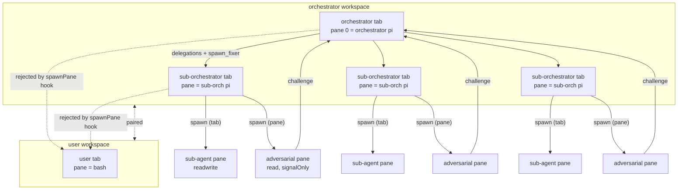

# Spec-2 — Orchestrator v2 + User Workspace

> **Source of truth:** fixture spec under `fixtures/sandbox-spec/src/`, runtime
> impl under `impl/`, and the ADRs under `docs/adr/`. The plan that drives
> this rewrite is at `spec-2_orchestrator_v2_+_user_workspace_7cb68ec4.plan.md`
> in the parent plans store.
>
> Spec-2 takes the orchestrator v1 (read-only orchestrator + sub-orchestrators
> + adversarial swarm + surgical fixers, all flat) and adds two structural
> constraints:
>
> 1. **One orchestrator per orchestrator workspace** — the orchestrator lives
>    in pane 0 of the first tab; sub-orchestrators live in **additional tabs**
>    of the same workspace, never in panes of the orchestrator's tab.
> 2. **A reserved user workspace and user tab** — every orchestrator workspace
>    ships with a dedicated `user` workspace/tab; no sub-orchestrator may
>    ever be spawned into it. No herdr fork; the reservation is enforced by
>    the orchestrator's runtime hooks and the tab-name convention.

This document is the **glossary and architecture reference** for spec-2. It
defines every term, the scope changes from the prior spec, the architecture
diagram, and what is explicitly out of scope.

---

## 1. Glossary

> Each term is defined as it is used in spec-2. References point at the file
> that contains the canonical definition or runtime hook.

### 1.1 `workspace`
A herdr workspace. The top-level container in herdr that holds tabs, panes,
and a single default cwd. Concretely a workspace is what `herdr tab create
--workspace <id>` writes into and what `herdr pane list` groups panes under.
Every workspace has exactly one orchestrator (or one user) as its first
occupant, and zero or more additional tabs. See
`fixtures/sandbox-spec/src/governance.ts` and `impl/pty/herdr-session.ts`
(`spawnPaneInNewTab`, `parseWorkspaceId`).

### 1.2 `orchestrator workspace`
A herdr workspace whose first tab is an orchestrator. Every orchestrator
workspace ships with three things: the orchestrator's tab, a `user` tab, and
zero or more sub-orchestrator tabs. There is **exactly one orchestrator per
orchestrator workspace** — see ADR 0001. The runtime creates the orchestrator
workspace via `openOrchestratorSession()` in
`impl/orchestration/orchestrator-session.ts`, which then calls
`spawnOrchestrationTeam()` in `impl/orchestration/team-spawner.ts` to add
sub-orchestrator tabs.

### 1.3 `orchestrator`
A `pi` process running in pane 0 of the orchestrator tab. The orchestrator is
**read-only but fully autonomous**: it may plan, delegate, and dispatch
fixers, but its pane is gated by the `READ_ONLY_COMMAND_RE` allowlist in
`impl/pty/herdr-session.ts`. The orchestrator decides *what* to do; the
runtime only stops it from *writing*. `capability = "read"`, `depth = 0`.
The orchestrator's system prompt is built in `ORCHESTRATOR_SYSTEM_PROMPT` in
`impl/orchestration/orchestrator-session.ts`.

### 1.4 `user workspace`
A herdr workspace reserved for the user. Spec-2 opens **one user workspace per
orchestrator workspace** — they are paired. The user workspace is the only
place a human can directly drive the system: it runs bash, has readwrite
capability, and no sub-orchestrator is ever spawned into it. The tab ID
constant is `USER_WORKSPACE_TAB_ID = "user"` in
`fixtures/sandbox-spec/src/user-workspace.ts`. See ADR 0002 for the
limitations of runtime-only enforcement (OS-UID isolation belongs to spec-3).

### 1.5 `user tab`
A tab named `user` in the **user workspace** (1.4). The user tab is the bash
REPL the human drives. It is the only pane/tab in the user workspace. The
runtime hook in `impl/pty/herdr-session.ts:spawnPane` (Phase 1.3) refuses to
spawn any pane into a tab whose label starts with `user-`, which is the
mechanical guarantee that no sub-orchestrator can land in the user tab. The
orchestrator's system prompt carries the same rule in plain English
("Never spawn sub-orchestrators into a tab whose label starts with `user-`").

### 1.6 `sub-orchestrator tab`
Any tab in the **orchestrator workspace** (1.2) other than the orchestrator's
first tab and other than the user tab. One sub-orchestrator tab per
workstream (e.g. `scaffold_2`, `deps`, `git-worktree`). Created by
`spawnPaneInNewTab` in `impl/pty/herdr-session.ts` with a label like
`orch-scaffold_2` and a fresh pane running `pi --version`. The team spawner
in `impl/orchestration/team-spawner.ts:spawnSubOrchestrator` issues these
calls in Phase B.

### 1.7 `sub-orchestrator`
A read-only `pi` process that runs inside a sub-orchestrator tab. Like the
orchestrator it has `capability = "read"`, but it is *not* in pane 0 of its
workspace — it shares the orchestrator's workspace, just in its own tab. A
sub-orchestrator delegates work to sub-agents; the sub-orchestrator is itself
spawned and managed by the orchestrator. Represented in the spec by
`SubOrchestratorHandle` in `fixtures/sandbox-spec/src/orchestration.ts`. Depth
1 by default; max depth is `SUB_ORCHESTRATOR_MAX_DEPTH = 3`.

### 1.8 `sub-agent`
A worker process spawned by a sub-orchestrator (or, in shallow workstreams,
directly by the orchestrator). Sub-agents live as **panes inside a
sub-orchestrator tab** — the `tabPlacement: "pane"` default in
`fixtures/sandbox-spec/src/multiplexing.ts:SubAgentConfig`. A sub-agent may
be `read` or `readwrite` (`Capability` from
`fixtures/sandbox-spec/src/governance.ts`). Read-write sub-agents are
**unconstrained by the runtime allowlist** — they can run any command in
their pane. OS-level isolation of read-write sub-agents belongs to spec-3,
out of scope here.

### 1.9 `adversarial sub-agent`
A signal-only sub-agent: `capability: "read"`, `signalOnly: true`. Its only
allowable signal is `challenge`. It reads the work in progress and emits
`Challenge` verdicts with `severity: "block" | "warn"`. Defined in
`impl/orchestration/adversarial-protocol.ts` and produced in Phase C of
`spawnOrchestrationTeam()` in `impl/orchestration/team-spawner.ts`. The
adversarial swarm is one adversarial per sub-orchestrator + one global
adversarial (`GLOBAL_ADVERSARIAL_NAME = "adv-global"`) that targets pane 0
itself.

### 1.10 `surgical fixer`
A readwrite sub-agent that the orchestrator dispatches on demand when the
adversarial swarm blocks a workstream. The fixer's job is to apply the
**minimum, precise patch** that resolves a `block` challenge. The orchestrator
looks the fixer up in `/etc/surgical-fixers` (the registry written by
`writeSurgicalFixersRegistry` in `team-spawner.ts`); the runtime entry point
is `spawnFixer()` in the same file. The fixer's prompt lives in
`impl/scripts/prompts/surgical-fixer.md`.

---

## 2. Scope changes from the previous spec

The previous spec (spec-1, captured in `sandbox/impl/docs/ADR-0007-readonly-orchestrator.md`
and the v1 DESIGN.md) defined an orchestrator-per-workspace concept but left
ambiguity on three structural questions. Spec-2 pins them down with these
five clarifications, each backed by local repo evidence.

### 2.1 One orchestrator in the first tab of each orchestrator workspace

> **What changed:** Previously the orchestrator was the only pane in the
> workspace's first tab, and sub-orchestrators could be added as additional
> panes *in that same tab*. Spec-2 forbids this.

**Rationale.** Sub-orchestrators as panes share the orchestrator's tab and
therefore its terminal buffer; long-running sub-orchestrator output buries
the orchestrator's plan. OpenHands' runtime model uses a single workspace per
session (`WORKSPACE_BASE` in `repos/OpenHands/containers/app/Dockerfile`),
which is the wrong granularity for our case — we need multiple cooperating
workspaces, not one. Opencode's permission system (`repos/opencode/packages/core/src/permission.ts`)
treats sessions as the isolation boundary and exposes per-session
`Ruleset`s; this aligns with the spec-2 model of one orchestrator per
workspace, with each workspace holding its own per-tab policy. The opensrc
skill at `repos/opensrc/skills/opensrc/SKILL.md` is the canonical way to
cross-reference such external implementations; we used it to read both
repos. See ADR 0001.

### 2.2 Sub-orchestrators = tabs only, never panes

> **What changed:** `SubAgentConfig.tabPlacement` is now an explicit
> `"tab" | "pane"` enum, defaulting to `"pane"`. Sub-orchestrators must
> pass `"tab"`.

**Rationale.** Tabs give herdr-level isolation: each sub-orchestrator's
buffer, focus, and pane-id namespace are independent. OpenHands does the
same conceptually via its per-conversation event log
(`repos/OpenHands/openhands/app_server/sandbox/`) — events from one
conversation never leak into another. Opencode's permission ruleset is
per-session, again reinforcing the session/tab as the isolation unit. Pinning
sub-orchestrators to tabs means the same isolation property the user already
sees on the TUI carries through to the orchestrator's internal structure.

### 2.3 Read-write sub-agents are unconstrained by the runtime allowlist

> **What changed:** `Capability = "readwrite"` no longer triggers
> `READ_ONLY_COMMAND_RE` in `herdr-session.ts:runInPane`. The allowlist only
> applies to `read`.

**Rationale.** A read-write sub-agent that the orchestrator dispatched to
apply a surgical patch is exactly the agent that needs to run `npm install`,
`git commit`, or `rm`. Gating it would break the surgical-fixer contract.
OS-level isolation (Docker `--user` per pane, separate containers per
capability tier) is the proper way to constrain what a misbehaving
read-write sub-agent can do, and that work is **spec-3**, not spec-2. The
opensrc skill at `repos/opensrc/skills/opensrc/SKILL.md` is what spec-3 will
use to read how OpenHands and opencode implement OS-level isolation when
that work begins.

### 2.4 The orchestrator is read-only but fully autonomous

> **What changed:** No `MUST`, no `MUST NOT`, no policy script. The
> orchestrator decides what to do; the runtime only stops it from writing.

**Rationale.** Earlier drafts included policy scripts that told the
orchestrator what kinds of plans to emit ("always include a verification
step", "never use sub-orchestrators for read-only tasks"). Those scripts
were not enforceable and made the orchestrator a puppet. Opencode's
permission system (`repos/opencode/packages/core/src/permission.ts`) draws
the same line: rules are declarative data; the *agent* decides when to act;
the *runtime* decides whether the action is allowed. The orchestrator's
system prompt lists the available sub-orchestrator templates, the
adversarial protocol, and the spawn_fixer lookup — but does not prescribe
*when* to use them. This matches opencode's `Effect = "allow" | "deny" |
"ask"` model in `repos/opencode/packages/core/src/permission/schema.ts`.

### 2.5 Dedicated user workspace + user tab; runtime reservation only

> **What changed:** A user workspace is opened alongside every orchestrator
> workspace. The user tab label is fixed to `user` and the runtime
> `spawnPane` hook refuses to add a pane to any tab whose label starts with
> `user-`. No herdr fork is used.

**Rationale.** The user needs a place to drive the system directly. The
OpenHands sandbox model (`repos/OpenHands/openhands/app_server/sandbox/`)
exposes a per-session workspace, but does not formally separate the user's
interaction from the agent's work — that separation is enforced at the
runtime hook layer in their case too. Opencode's permission schema
(`repos/opencode/packages/core/src/permission/schema.ts`) is the closest
analog to a "user" capability, but it is session-scoped, not tab-scoped, so
we model the user tab as a sibling of the orchestrator tab rather than as
a special agent identity. **Limitation:** if a sub-agent shells out to
`docker exec herdr ...` directly, it bypasses the runtime hook; spec-3's
OS-UID separation is the proper mitigation. See ADR 0002.

---

## 3. Architecture summary

Spec-2's architecture is a four-level nesting: **workspace → tab → pane →
process**. The orchestrator owns its workspace and one tab within it; the
user owns a paired workspace and one tab; sub-orchestrators share the
orchestrator's workspace but get their own tabs; sub-agents share their
sub-orchestrator's tab but get their own panes.

**Key invariants (enforced in code):**

- The orchestrator tab is **the first tab** of the orchestrator workspace;
  pane 0 of that tab is the orchestrator. `openOrchestratorSession` in
  `impl/orchestration/orchestrator-session.ts` opens the workspace and pins
  pane 0.
- Sub-orchestrator tabs are **siblings** of the orchestrator tab, created by
  `spawnPaneInNewTab` in `impl/pty/herdr-session.ts`. They are not panes of
  the orchestrator tab.
- The user workspace is **paired one-to-one** with each orchestrator
  workspace. It is opened by `spawnOrchestrationTeam` (Phase 1.3) and its
  handle is returned on `OrchestratorSession.userWorkspace`.
- The `spawnPane` runtime hook in `impl/pty/herdr-session.ts` rejects
  `herdr agent start --tab user-*` with an `Error`. This is the only
  mechanical guarantee against a misbehaving sub-orchestrator landing in
  the user tab.

---

## 4. What is out of scope

The following are **explicitly excluded** from spec-2 and tracked elsewhere:

- **OS-UID separation (spec-3).** The runtime allowlist in
  `herdr-session.ts` stops the orchestrator and read-only sub-orchestrators
  from issuing write commands, but a sub-agent that already has
  `readwrite` capability can run anything inside the container. The proper
  mitigation is OS-level: separate UIDs, separate containers, or
  seccomp/AppArmor profiles per capability tier. This is spec-3, tracked
  under `docs/adr/` of the spec-3 worktree.

- **Forks of herdr or pi.** Spec-2 does not introduce a herdr fork. The
  user-workspace reservation is enforced at the orchestrator's runtime
  hook layer (`spawnPane` rejects `user-*` tab labels) and by convention in
  the orchestrator's system prompt. A herdr fork would be the right place
  to enforce the reservation at the daemon level, but that is a much
  larger change and is not in scope here.

- **Cross-orchestrator policy negotiation.** Spec-2's flat governance
  (ADR 0004 + 0005, restated in `sandbox/impl/docs/ADR-0007-readonly-orchestrator.md`)
  treats every agent as a peer of its parent and siblings. There is no
  mechanism for one orchestrator's sub-agent to talk to another
  orchestrator's sub-agent directly. Such cross-workspace coordination is
  out of scope; it would need its own governance ruleset, not a special
  case in the runtime.

- **Adversarial swarm and surgical fixer protocols.** These are inherited
  from spec-1 verbatim. Spec-2 reuses `adversarial-protocol.ts` and
  `team-spawner.ts` as-is. Changes to the protocol itself are out of scope.

---

## 5. References

- Plan: `~/.cursor/plans/spec-2_orchestrator_v2_+_user_workspace_7cb68ec4.plan.md`
- ADRs: `docs/adr/0001-orchestrator-per-workspace.md`, `docs/adr/0002-user-workspace.md`
- Spec: `fixtures/sandbox-spec/src/{governance,multiplexing,orchestration,user-workspace}.ts`
- Impl: `impl/orchestration/{orchestrator-session,team-spawner}.ts`, `impl/pty/herdr-session.ts`
- Prior ADRs: `impl/docs/ADR-0006-live-test-architecture.md`, `impl/docs/ADR-0007-readonly-orchestrator.md`
- Cross-references: `repos/OpenHands/`, `repos/opencode/`, `repos/opensrc/`
